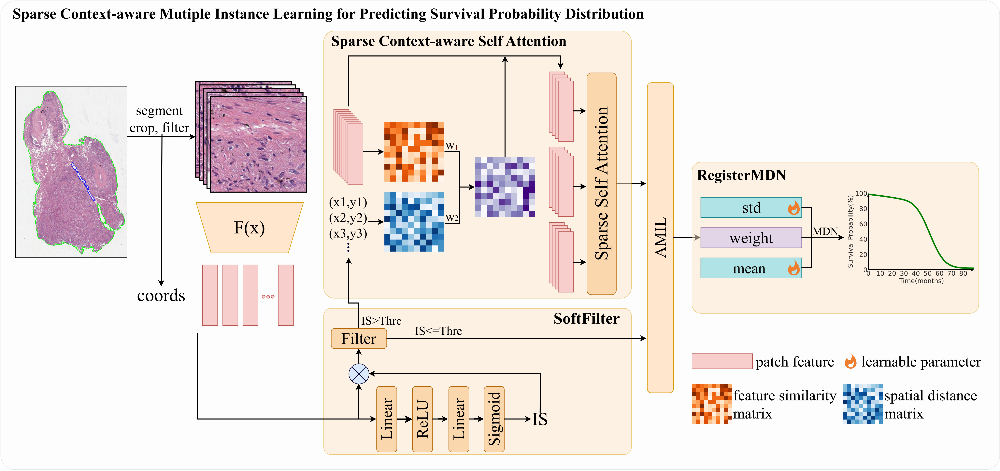
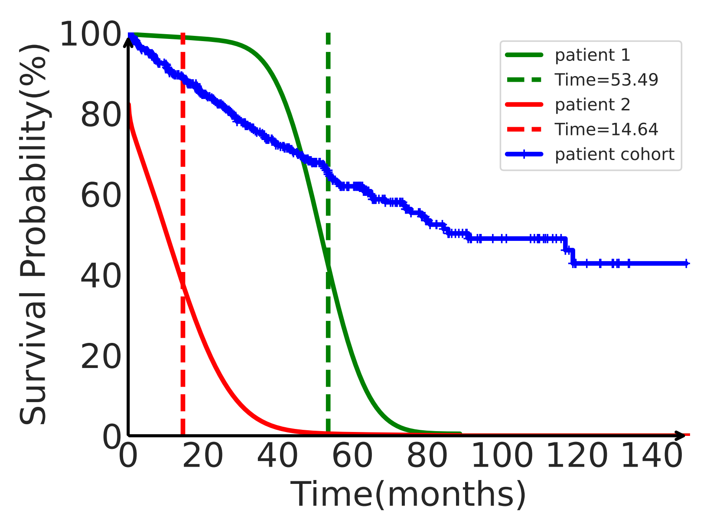

# SCMIL

Official implementation for "SCMIL: Sparse Context-aware Multiple Instance Learning for Predicting Cancer Survival Probability Distribution in Whole Slide Images"(Accepted by MICCAI2024)

[](https://opensource.org/licenses/MIT)




## Abstract

> Cancer survival prediction is a challenging task that involves analyzing of the tumor microenvironment within Whole Slide Image (WSI). Previous methods cannot effectively capture the intricate interaction features among instances within the local area of WSI. Moreover, existing methods for cancer survival prediction based on WSI often fail to provide better clinically meaningful predictions. To overcome these challenges, we propose a Sparse Context-aware Multiple Instance Learning (SCMIL) framework for predicting cancer survival probability distributions. SCMIL innovatively segments patches into various clusters based on their morphological features and spatial location information, subsequently leveraging sparse self-attention to discern the relationships between these patches with a context-aware perspective. Considering many patches are irrelevant to the task, we introduce a learnable patch filtering module called SoftFilter, which ensures that only interactions between task-relevant patches are considered. To enhance the clinical relevance of our prediction, we propose a register-based mixture density network to forecast the survival probability distribution for individual patients. We evaluate SCMIL on two public WSI datasets from the The Cancer Genome Atlas (TCGA) specifically focusing on lung adenocarcinom (LUAD) and kidney renal clear cell carcinoma (KIRC). Our experimental results indicate that SCMIL outperforms current state-of-the-art methods for survival prediction, offering more clinically meaningful and interpretable outcomes.

## Installation

- Environment: Linux / CUDA 11.3 / Python 3.9
- Create a virtual environment

  ```bash
  conda create -n scmil python=3.9
  source activate scmil
  ```
- Install pytorch

  ```
  pip install torch==1.12.1+cu113 torchvision==0.13.1+cu113 --extra-index-url https://download.pytorch.org/whl/cu113
  ```
- Install cuML

  ```bash
  spip install --extra-index-url=https://pypi.nvidia.com cudf-cu11==23.10.0 cuml-cu11==23.10.0
  ```
- Other requirements

  ```bash
  pip install tqdm
  pip install lifelines
  pip install munch
  pip install tensorboardX
  pip install einops
  pip install h5py
  pip install seaborn
  ```

## Download dataset and Pretrain weights

1. Download diagnostic WSIs and clinical information from [TCGA](https://portal.gdc.cancer.gov/)
2. Use the WSI processing tool provided by [CLAM](https://github.com/mahmoodlab/CLAM) to crop WSIs into 256 × 256 patches at 20x magnification.
3. Use [vit](https://github.com/lunit-io/benchmark-ssl-pathology#pre-trained-weights) that pre-trained on a large-scale collection of WSIs using self-supervised learning to extract features of patches.

## Train

1. Prepare dataset annotation file
   To facilate data loading, you should prepare your own 'wsi_annos_vit-s-dino-p16.txt'

   ```bash
   data
    ├── kirc
    │   ├── 5fold_wsi-rnaseq
    │   │   ├── fold1
    │   │   │   ├── train.txt
    │   │   │   └── val.txt
    │   │   ├── ...
    │   │   └── fold5
    │   ├── clinical.csv
    │   └── wsi_annos_vit-s-dino-p16.txt
    └── luad
        ├── 5fold_wsi-rnaseq
        │   ├── fold1
        │   │   ├── train.txt
        │   │   └── val.txt
        │   ├── ...
        │   └── fold5
        ├── clinical.csv
        └── wsi_annos_vit-s-dino-p16.txt
   ```

  wsi_annos_vit-s-dino-p16.txt

```bash
patient_id,wsi_id,label,feature_h5_path
 ...
```

2. Train
   ```bash
   # train kirc
   python train.py --config configs/kirc_scmil.py
   python train.py --config configs/kirc_amil.py

   # train luad
   python train.py --config configs/luad_scmil.py
   python train.py --config configs/luad_amil.py
   ```

## Visual results

Plot survival probability distribution
   ```
   python plot_survival_probability.py --config configs/kirc_scmil.yaml
   ```


## License & Citation 
If you find our work useful in your research, please consider citing our paper at:

```text
@misc{yang2024scmilsparsecontextawaremultiple,
      title={SCMIL: Sparse Context-aware Multiple Instance Learning for Predicting Cancer Survival Probability Distribution in Whole Slide Images}, 
      author={Zekang Yang and Hong Liu and Xiangdong Wang},
      year={2024},
      eprint={2407.00664},
      archivePrefix={arXiv},
      primaryClass={cs.CV},
      url={https://arxiv.org/abs/2407.00664}, 
}
```
